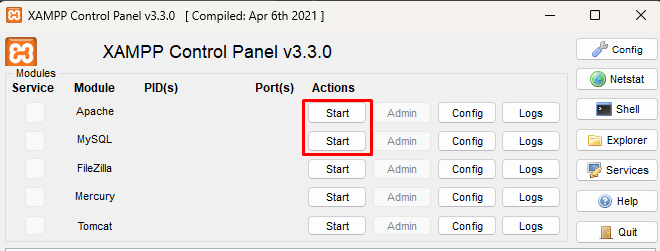

# Gerenciador de Projetos - InfoTech

[](https://laravel.com/)
[](https://www.php.net/)
[](https://nodejs.org/)

O **Gerenciador de Projetos** é um sistema web desenvolvido em Laravel que permite o gerenciamento de projetos e tarefas, com controle de permissões para administradores e clientes para a vaga de programador da empresa Infotech - Soluções em Tecnologia.

## Tecnologias

O projeto utiliza as seguintes tecnologias e ferramentas:

-   [Laravel](https://laravel.com/) - Framework PHP para desenvolvimento de aplicações web
-   [Blade](https://laravel.com/docs/8.x/blade) - Template engine do Laravel
-   [MySQL](https://www.mysql.com/) - Banco de dados relacional
-   [Node.js](https://nodejs.org/) & [npm](https://www.npmjs.com/) - Gerenciador de pacotes e ambiente para o frontend

## Requisitos

Para rodar o projeto, é necessário ter os seguintes softwares instalados:

-   [XAMPP](https://www.apachefriends.org/) (ou outro servidor Apache + MySQL)
-   [Composer](https://getcomposer.org/) - Gerenciador de dependências PHP
-   [Node.js](https://nodejs.org/) - Ambiente JavaScript
-   [npm](https://www.npmjs.com/) - Gerenciador de pacotes Node.js
-   [Git](https://git-scm.com/) - Controle de versão

## Instalação

Siga os passos abaixo para configurar o projeto localmente:

### 1. Clone o repositório

```bash
git clone https://github.com/seu-usuario/seu-repositorio.git
cd gerenciador-projetos
```

### 2. Instale as dependências do PHP

```bash
composer install
```

### 3. Instale as dependências do Node.js

```bash
npm install
```

### 4. Configure o arquivo `.env`

Copie o arquivo `.env.example` para `.env`:

```bash
cp .env.example .env
```

Atualize as variáveis de ambiente no `.env`, incluindo as configurações do banco de dados:

```bash
DB_CONNECTION=mysql
DB_HOST=127.0.0.1
DB_PORT=3306
DB_DATABASE=nome_do_banco
DB_USERNAME=usuario_do_banco
DB_PASSWORD=senha_do_banco
```

### 5. Gere a chave da aplicação

```bash
php artisan key:generate
```

### 6. Inicie o Apache e o MySql no XAMPP

Clique em `Start` no Apache e no MySql



### 7. Execute as migrações

```bash
php artisan migrate --seed
```

### 8. Compile os assets

```bash
npm run dev
```

### 9. Inicie o servidor

```bash
php artisan serve
```
